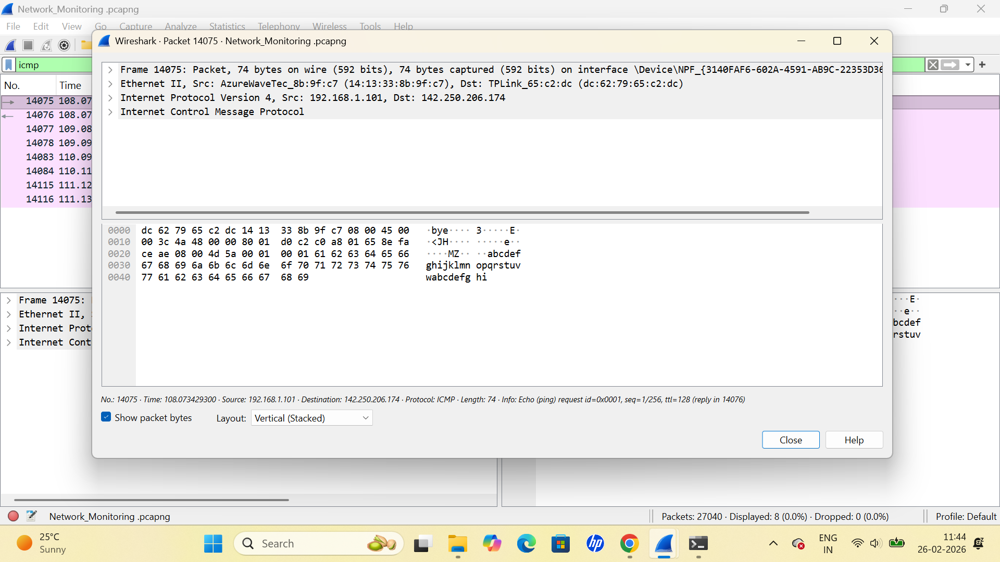
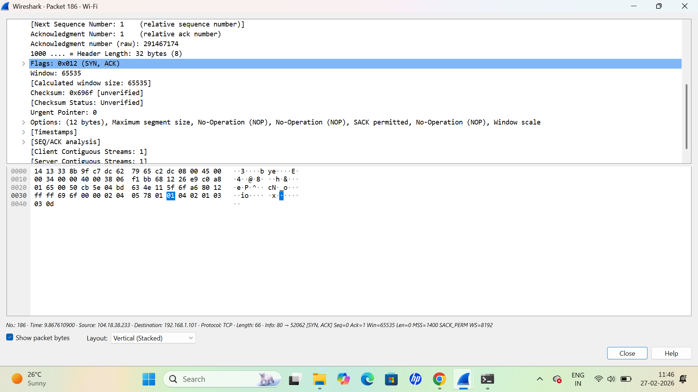
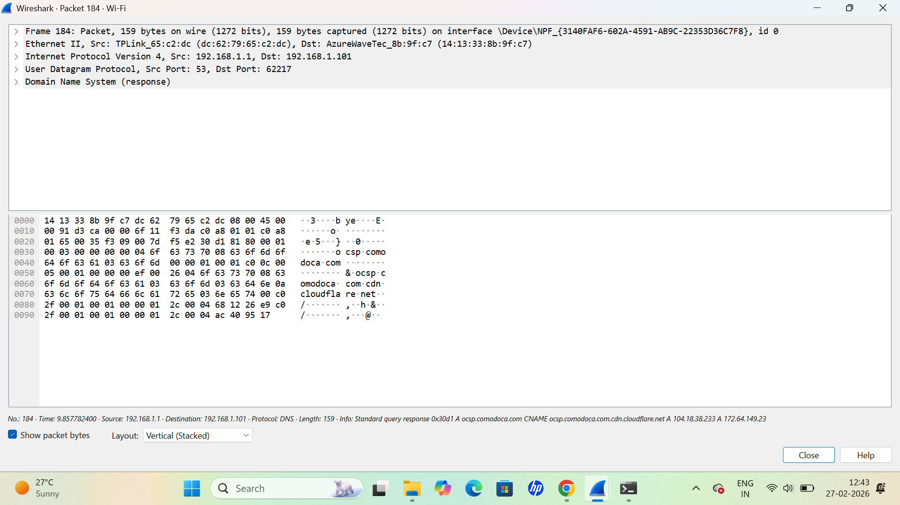
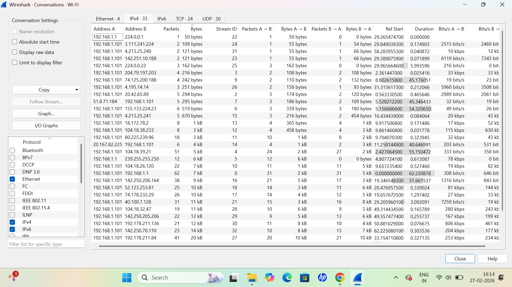

# Network Traffic Monitoring & Packet Analysis (Wireshark)

This project demonstrates practical network traffic monitoring using Wireshark. Live traffic was captured and analyzed to study protocol behavior, TCP three-way handshake, DNS resolution, ICMP communication, and bandwidth utilization patterns.

## Key Analysis Performed

- Captured live traffic using Wireshark
- Analyzed TCP three-way handshake (SYN, SYN-ACK, ACK)
- Inspected DNS query and response packets
- Observed ICMP echo request and reply traffic
- Evaluated bandwidth usage using IPv4 conversation statistics

## Packet Analysis Screenshots

### ICMP Echo Request

### TCP SYN-ACK Analysis

### DNS Response Analysis

### Bandwidth Analysis (IPv4 Conversations)

